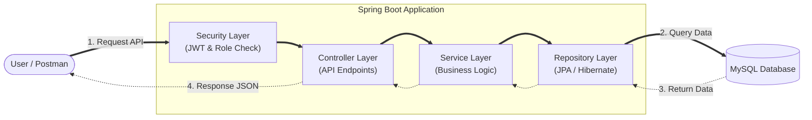
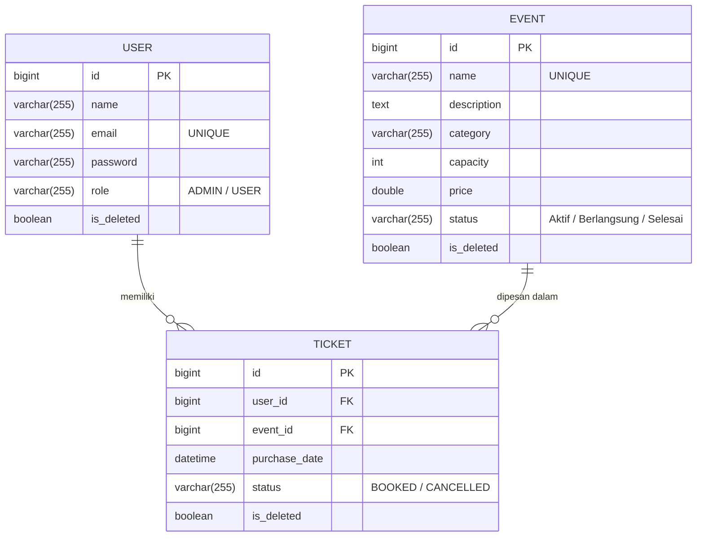

# Ticketing API

Ticketing API is a RESTful backend service built for event ticketing management. The system is designed using Java Spring Boot and provides secure, role-based access for managing events, booking tickets, and generating analytics reports.

## Architecture and Tech Stack

The application follows a standard Model-View-Controller (MVC) architectural pattern:
- **Framework**: Java 17, Spring Boot 3.x
- **Database**: MySQL 8
- **ORM**: Hibernate / Spring Data JPA
- **Security**: Spring Security with Stateless JSON Web Tokens (JWT)
- **Containerization**: Docker & Docker Compose

## System Architecture Diagrams

### Application Flow


### Database Entity Relationship Diagram (ERD)


## Prerequisites

To run this project locally, ensure you have the following installed:
- Java Development Kit (JDK) 17
- Apache Maven
- Docker and Docker Compose (recommended for deployment)

## Environment Variables

Configuration is managed via `src/main/resources/application.properties`. Ensure the following properties match your environment if running without Docker:
- `spring.datasource.url`
- `spring.datasource.username`
- `spring.datasource.password`
- `jwt.secret` (Must be at least 256-bit for HS256)
- `jwt.expiration` (in milliseconds)

## Installation & Setup

### Method 1: Using Docker (Recommended)

1. Build the application package:
   ```bash
   mvn clean package -DskipTests
   ```
2. Start the services (App and Database) using Docker Compose:
   ```bash
   docker-compose up --build -d
   ```
The API will be available at `http://localhost:8080`.

### Method 2: Manual / Local Execution

1. Create a local MySQL database named `ticketing_db`.
2. Update the database credentials in `application.properties`.
3. Run the application via Maven:
   ```bash
   mvn spring-boot:run
   ```

## API Endpoints Overview

All endpoints except authentication require a valid Bearer Token in the `Authorization` header.

### Authentication (Public)
- `POST /register` : Register a new user (Default role: USER).
- `POST /login` : Authenticate user and receive JWT.

### Events (Protected)
- `GET /events` : Retrieve paginated events with optional filtering (keyword, category, status).
- `POST /events` : Create a new event **(ADMIN only)**.
- `PUT /events/{id}` : Update an existing event **(ADMIN only)**.
- `DELETE /events/{id}` : Delete an event. Fails if tickets are already booked **(ADMIN only)**.

### Tickets (Protected)
- `POST /tickets` : Book a ticket for an active event. Fails if capacity is full.
- `GET /tickets` : Retrieve paginated tickets. (ADMIN sees all, USER sees only their own).
- `PATCH /tickets/{id}` : Cancel a booked ticket.

### Reports (Protected - ADMIN only)
- `GET /reports/summary` : Get total revenue and tickets sold.
- `GET /reports/event/{id}` : Get ticket details for a specific event.

## Role Assignment Note
By design, all new registrations via `/register` default to the `USER` role. To perform administrative actions (e.g., creating events or viewing reports), you must manually update a user's role to `ADMIN` directly in the database.
